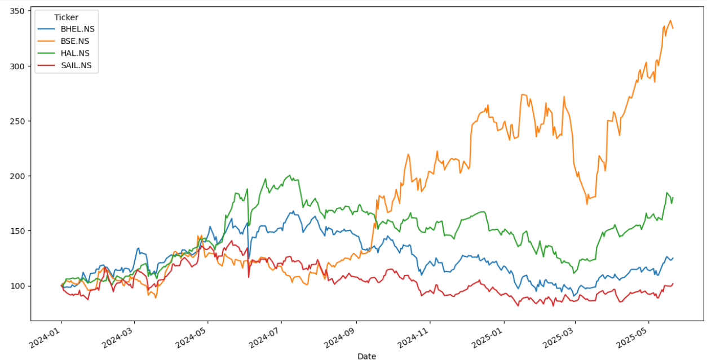
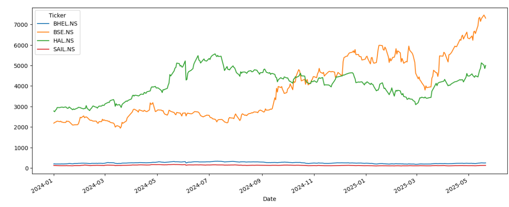

# 📊 FinAnalytics-Python

A beginner-friendly quantitative finance project that performs time series analysis and return calculations on selected Indian stocks using Python, Yahoo Finance API, and visualization libraries.

## 🚀 Features

- Download stock data using `yfinance`
- Plot raw and normalized price trends
- Calculate:
  - Daily returns
  - Average annual returns
  - Logarithmic returns
  - Annualized standard deviation (volatility)
- Basic financial data visualization using `matplotlib`

## 📂 Files

- `stocks.py` – main script for fetching and analyzing stock data
- `plots/Normalized.png` – visual comparison of normalized stock prices
- `plots/Unnormalized.png` – raw stock price trends

## 📈 Sample Plots

### ✅ Normalized Prices

### 📉 Raw Stock Prices

## 📌 Tickers Used

- BHEL.NS
- SAIL.NS
- BSE.NS
- HAL.NS

## 📚 Tools & Libraries

- Python 3
- [yfinance](https://pypi.org/project/yfinance/)
- Matplotlib
- Pandas
- NumPy

---

## 💡 Future Work

- Portfolio optimization
- Sharpe Ratio calculation
- Correlation heatmap
- Strategy backtesting (SMA/EMA, momentum)
